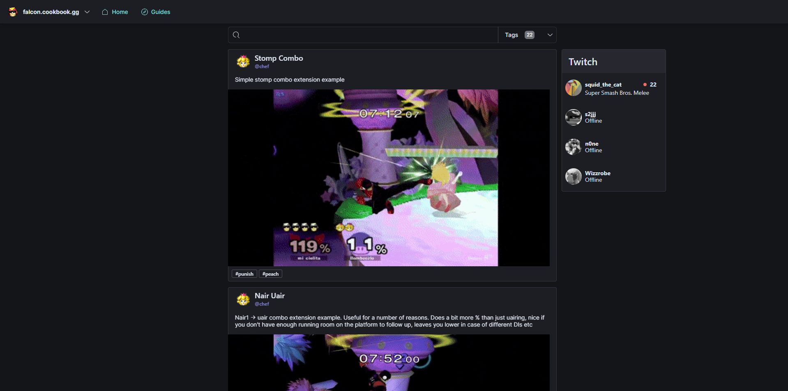

# Getting Started with Cookbook.gg

The repository for the [Cookbook.gg](https://www.cookbook.gg) website.
This repository only contains the frontend code, for the backend check out
[this repository](https://github.com/skbrown333/api-cookbook).

The frontend runs using [React](https://reactjs.org/) with TypeScript and the
[Elastic UI](https://elastic.github.io/eui/#/navigation/button) component library.

## Prerequisites

1. Get the latest Long Term Support (LTS) version of [NodeJS](https://nodejs.org/en/)
2. Install [Yarn](https://classic.yarnpkg.com/en/) using npm by executing
`npm install --global yarn` within a command line.

## Configuring the frontend

1. Ensure that you are in the dev Discord and either message Steffan or Stump to
get the .env files to work with the application.
2. Create an .env within the root of the project and set the configured values.

## Building and running the project

1. Install the dependencies by executing `yarn install` in a command line.
This only has to be done once and when dependencies are updated.
2. Run `yarn start` to run the application and serve it at
[http://localhost:3000](http://localhost:3000).

At this point an error should pop up because the backend can not be reached.
To set up the backend, follow the readme in [this repository](https://github.com/skbrown333/api-cookbook).

## Installing an editor

It is recommended to use [Visual Studio Code](https://code.visualstudio.com/) as
the code editor to work with this project. It is free and has a large amount of
extensions and community support. When starting out with VS Code, follow the tutorials
to get an idea of how to work with the editor and install a React extension pack.

Every developer has different preferences so try out different extensions and see
what works for you.

## Starting on a ticket

Most communication is done through the cookbook.gg Discord.
This also includes development work and being invited to the Jira board to view Tickets.
When starting on a ticket, create a branch using the naming scheme `#-branch-name`.
For example: `106-multiple-gfys-per-line`.

When you are done developing the feature, sent a pull request on GitHub and assign
one of the code owners as a reviewer.
You will also need change the assignee in Jira to the reviewer and place
the ticket in the review column.
